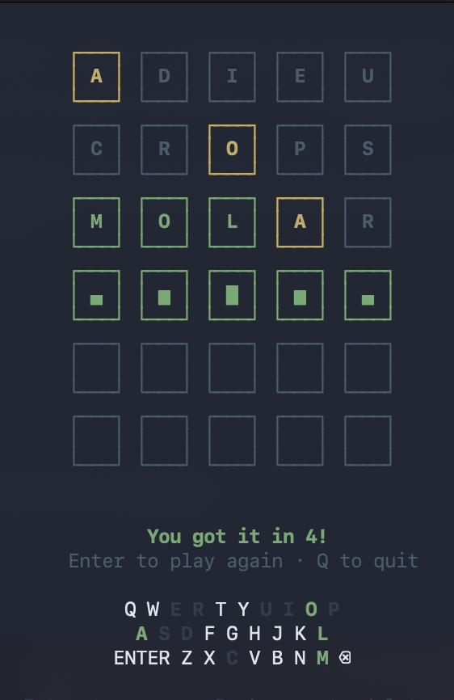

# termle

Wordle in your terminal, built with React and [Ink](https://github.com/vadimdemedes/ink).



## Features

- Fetches the original NYT Wordle word list on startup
- Tile reveal animation with per-tile flip
- Row shake on invalid guess
- Correct tile jump and win bounce animations
- Keyboard tracker showing used letters

## Install

```bash
git clone <repo-url>
cd termle
npm install
npm run build
npm link
```

Then from anywhere:

```bash
termle
```

## Controls

| Key | Action |
|-----|--------|
| Letters | Type a guess |
| Enter | Submit |
| Backspace | Delete letter |
| Enter *(after game ends)* | Play again |
| Q *(after game ends)* | Quit |
| Ctrl+C | Quit anytime |

## Development

```bash
npm start        # typecheck + build + run
npm run build    # build only
npm run typecheck  # tsc type check only
```
